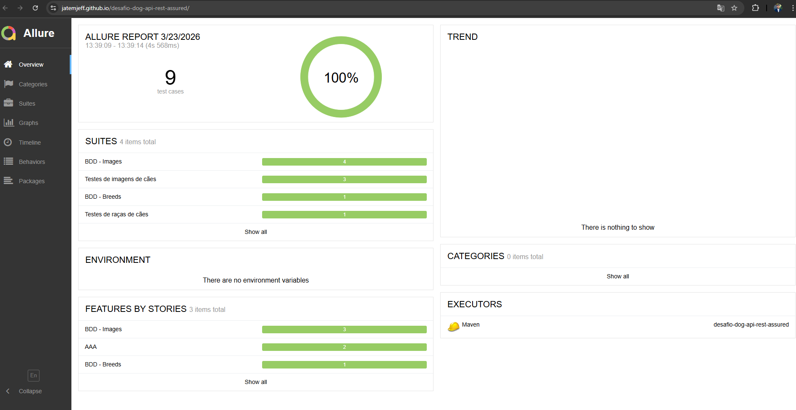

# 🐶 Dog API Test Automation (REST Assured + BDD + CI/CD)


Projeto de automação de testes para a API pública [Dog API](https://dog.ceo/dog-api/), utilizando **Java + RestAssured + Cucumber (BDD)**, com foco em boas práticas, arquitetura e qualidade de testes.

---

## 🚀 Objetivo

Validar o comportamento da API de forma robusta, aplicando práticas modernas de QA como:

- Contract testing (validação de JSON Schema)
- Validação de regras de negócio
- Testes de performance básica
- Automação estruturada com BDD e padrão AAA

---

## 🧰 Tecnologias Utilizadas

- Java 21
- Maven
- RestAssured
- Cucumber (BDD)
- JUnit 5
- AssertJ
- JSON Schema Validator

---

## 🧱 Arquitetura do Projeto

O projeto segue uma arquitetura em camadas:

```
src
├── test
│   ├── java/com.jeff.dogapi
│   │   ├── client
│   │   │   └── DogApiClient
│   │   │        → Responsável pela comunicação HTTP (REST)
│   │
│   │   ├── service
│   │   │   ├── BreedsService
│   │   │   └── ImagesService
│   │   │        → Encapsula chamadas da API e endpoints
│   │
│   │   ├── validator
│   │   │   └── BreedsValidator
│   │   │        → Contém todas as validações e assertions
│   │
│   │   ├── steps
│   │   │   ├── BreedsSteps
│   │   │   ├── ImagesSteps
│   │   │   └── CommonSteps
│   │   │        → Implementação dos steps do BDD (Cucumber)
│   │
│   │   ├── context
│   │   │   └── TestContext
│   │   │        → Compartilha estado entre os steps
│   │
│   │   ├── runner
│   │   │   └── TestRunner
│   │   │        → Configuração e execução dos testes BDD
│   │
│   │   ├── tests
│   │   │   ├── BreedsTest
│   │   │   └── ImagesTest
│   │   │        → Testes programáticos usando padrão AAA (JUnit)
│   │
│   │   └── utils
│   │       └── PathEnum
│   │            → Centraliza endpoints e evita hardcode
│   │
│   └── resources
│       ├── features
│       │    → Cenários BDD escritos em Gherkin
│       │
│       └── schemas
│            → Contratos JSON para validação (Contract Testing)
```

## 🔄 Fluxo de Execução dos Testes

    Feature (BDD)
    ↓
    Steps (Cucumber)
    ↓
    Service
    ↓
    Client (HTTP)
    ↓
    Response
    ↓
    Validator

---
## 🧠 Estratégia e Plano de Teste

### 🎯 Objetivo
Validar o comportamento da Dog API garantindo respostas corretas em termos de status, estrutura, regras de negócio e tempo de resposta.

---

### 📌 Escopo

**Incluído:**
- `/breeds/list/all`
- `/breed/{breed}/images`
- `/breeds/image/random`

**Não incluído:**
- Testes de carga
- Testes de segurança

---

### 🧪 Abordagem de Teste

- Contract testing com JSON Schema
- Validações funcionais (status, estrutura e regras de negócio)
- Testes positivos e negativos
- Performance básica (tempo de resposta)
- Uso de BDD (Cucumber) para comportamento
- Uso de AAA (Arrange, Act, Assert) para testes programáticos

---

### 📊 Critérios de Aceite

- Status code correto (200, 404, etc.)
- Campo `status` com valor esperado (`success` ou `error`)
- Estrutura da resposta conforme schema
- Dados válidos (ex: URLs de imagem)
- Tempo de resposta menor que 2 segundos

---

### 🧪 Cenários Cobertos

**Listar todas as raças**
- Estrutura válida
- Nomes em lowercase
- Sub-raças consistentes

**Listar imagens por raça**
- Lista de URLs válida
- Lista não vazia

**Raça inválida**
- Retorno de erro (404)
- Status `error`

**Imagem aleatória**
- URL válida
- Estrutura conforme contrato

---

### ⚠️ Riscos

- Instabilidade da API externa
- Variação no tempo de resposta
- Mudanças no contrato da API

---

## ▶️ Como Executar

### 🔹 Executar todos os testes

```bash
mvn test
```

---

### 🔹 Executar via Runner

Classe:

```
TestRunner.java
```

---
### 🔹 Executar via Pacote ou Classes

Os testes podem ser executados diretamente pela IDE (ex: IntelliJ), clicando com o botão direito sobre a classe ou pacote desejado.

#### ✔ Execução via testes programáticos (AAA)

Local:
```
src/test/java/com/jeff/dogapi/tests
```

Classes:
```
BreedsTest.java  
ImagesTest.java
```

---

#### ✔ Execução via BDD (Cucumber)

Local:
```
src/test/resources/features
```

Arquivos:
```
Breeds.feature  
Images.feature
```

---

💡 Também é possível executar:

- Diretamente pela **classe de teste**
- Pelo **pacote completo**
- Ou via **runner do Cucumber**

---

## 🧠 Boas Práticas Aplicadas

- Separação de responsabilidades (SRP)
- Reuso de código
- Testes independentes
- Uso de enums para endpoints
- Context compartilhado com DI (PicoContainer)
- BDD com linguagem clara
- Uso do padrão AAA (Arrange, Act, Assert) em testes JUnit

---
## 🚀 CI/CD e Relatórios
O projeto utiliza **GitHub Actions** para execução automatizada dos testes e publicação dos relatórios.

---

### ⚙️ Pipeline

A cada *push*, *pull request* ou execução manual, a pipeline realiza:

- Setup do ambiente (**Java 21 + Maven**)
- Execução dos testes (**BDD + AAA**)
- Geração do relatório com **Allure**
- Publicação automática no **GitHub Pages**

---

### 📊 Relatório Interativo

Os resultados são disponibilizados via **Allure Report**, permitindo uma análise completa da execução:

- ✔ Status dos testes (pass/fail)
- ✔ Organização por suítes (BDD e AAA)
- ✔ Detalhamento de cenários e steps
- ✔ Logs de requisição e resposta
- ✔ Tempo de execução

🔗 **Acesse o relatório online:**  
👉 https://jatemjeff.github.io/desafio-dog-api-rest-assured/

### 📊 Exemplo do Relatório


---

### 🧠 Benefícios

- Feedback rápido a cada alteração
- Visibilidade completa da execução
- Fácil compartilhamento via URL
- Padrão utilizado em ambientes profissionais

---

## 👨‍💻 Autor

Jefferson de França Filho  
Senior QA Automation Engineer | SDET

---
